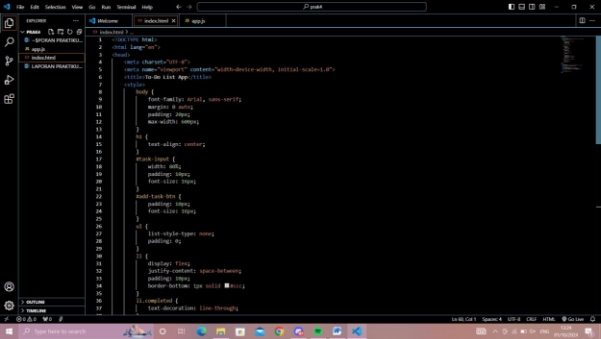
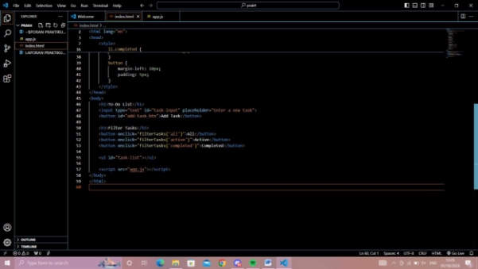
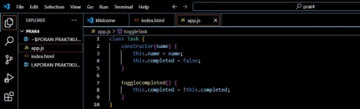
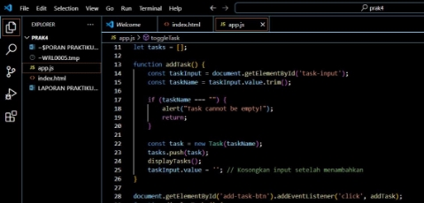
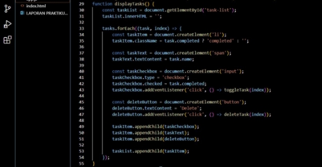
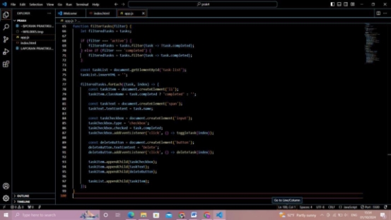
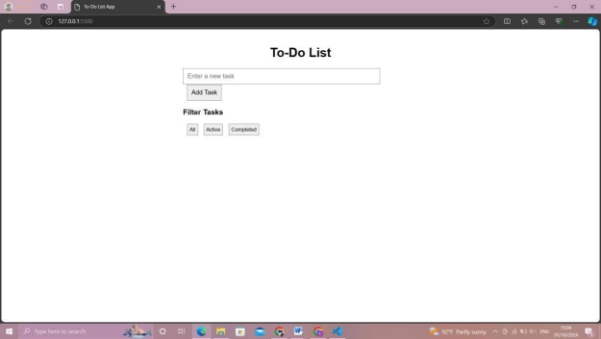
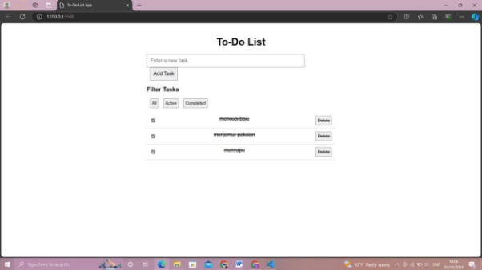
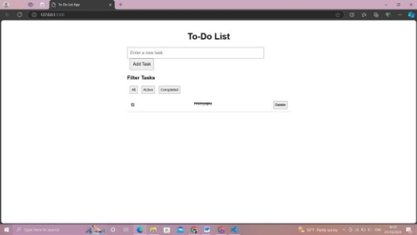

**LAPORAN PRAKTIKUM *JAVASCRIPT –*APLIKASI *TO-DO-LIST* DESAIN WEB (01 OKTOBER 2024)** 

**LINTANG TRIANDINI JULIA PUTRI 4523210060** 

Dosen Pembimbing : 

**Adi Wahyu Pribadi, S.Si., M.Kom.**

**FAKULTAS TEKNIK 
UNIVERSITAS PANCASILA JAKARTA** 

**2024** 

**PENDAHULUAN** 

- Tujuan dari praktikum ini adalah untuk memahami konsep dasar pemrograman JavaScript dan mengaplikasikannya dalam skenario dunia nyata. Dengan melakukan serangkaian percobaan, diharapkan mahasiswa mampu mengimplementasikan logika pemrograman yang efisien serta memahami bagaimana JavaScript dapat meningkatkan pengalaman pengguna di sebuah halaman web. 
- Aplikas to-do-list adalah aplikasi sederhana yang digunakan untuk mengelola daftar tugas atau pekerjaan yang perlu diselesaikan. Fungi utama dari aplikasi ini adalah untuk menambahakan, menandai maupun menghapus tugas yang telah dikerjakan.  
- Teori dasar yang meliputi aplikasi ini ialah CSS, javascript yang digunakan untuk 

  memanipulasi DOM, local strorage dan event handling. 

**CARA PENGERJAAN** 

1. Membuat index.html yang berisi struktur to-do-list tersebut, seperti input, memfilter tugas dan menghapus tugas. Serta membuat CSS untuk memberikan style pada elemen html.  

2. Membuat **file app.js** yang digunakan untuk menambahkan fitur yang memiliki property name dan completed

   **Fungsi classTask:** untuk menyimpan nama tugas dan mengubah tugas status.

   

3. Membuat fungsi untuk menambah tugas menggunakan fungsi addTask.

   **Fungsi addTask :** menambah tugas baru kedalam array dan menampilkan ulang daftar tugas

   

4. Menampilkan tugas di DOM. Fungsi dari displayTask digunakan untuk menampilkan daftar tugas pada elemen ul serta setiap tugas memiliki checkbox untuk menandai jika tugas selesai dikerjakan.

   

5. Menandai tugas selesai dan menghapus tugas. Menggunakan perintah dibawah ini,  memungkinkan pengguna untuk menandai tugas atau membatalkan tanda selesai. Bisa juga menghpus tugas dari daftar.  

   **Fungsi toggleTask :** mengubah status dari belum selesai ke selesai maupun selesai ke belum selesai. 

   **Fungsi deleteTask :** untuk menghapus tugas. 

   

6. Filter tugas berdasarkan status, user dapat memfilter tugas berdasarkan status.  

   

HASIL 

Tamplilan to-do-list 

Menambahkan tugas (dengan mengetik pada ‘enter a new task’ lalu kilik add task 

Menandai tugas dengan meng-klik checkbox pada kiri kolom  

Men-delete tugas dengan memencet tombol delete pada kanan box 

Memfilter tugas dengan 3 cara (all, active dan completed) 

Link github :  https://github.com/LintangTriandini/LintangTriandini- PrakDesainWeb/tree/main/prak4 
